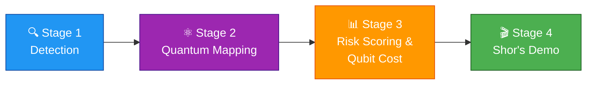

<div align="center">

# 🔐 AI-Powered PQC Migration Advisor

### Quantum-Vulnerability Testing Pipeline

**Detect → Map → Estimate → Migrate**
*Find the cryptography that quantum computers will break, and fix it before they do.*

<br>


<br>

🎓 *Final-year B.Tech CSE project · Hindustan College of Science and Technology, Mathura (AKTU)*

</div>

---

## 🌟 Overview

Today's public-key cryptography (RSA, ECC, DSA, DH) will not survive large-scale quantum computers. This project is a **complete pipeline** that:

- 🔍 **Scans** codebases for quantum-vulnerable cryptography
- ⚛️ **Maps** each primitive to the quantum algorithm that breaks it (**Shor's** / **Grover's**)
- 📊 **Estimates** the qubit cost of an attack
- 🛡️ **Recommends** a post-quantum migration path (**ML-KEM-768**)

---

## ⚛️ The Quantum Threat at a Glance

| Primitive | Broken By | Impact | Severity |
|:---|:---:|:---|:---:|
| **RSA** | Shor's | Completely broken | 🔴 Critical |
| **ECC** | Shor's | Completely broken | 🔴 Critical |
| **DSA / DH** | Shor's | Completely broken | 🔴 Critical |
| **AES** | Grover's | Effective key strength roughly halved | 🟡 Moderate |
| **SHA** | Grover's | Effective strength roughly halved | 🟡 Moderate |

---

## 🧭 Pipeline Stages



| # | Stage | What it does | Files |
|:-:|:---|:---|:---|
| 1️⃣ | 🔍 **Detection** | Scans source code for crypto usage and edge cases | `src/scanner.py`, `src/edge_cases.py` |
| 2️⃣ | ⚛️ **Quantum Mapping** | Maps each primitive to Shor's / Grover's | `src/quantum_mapper.py` |
| 3️⃣ | 📊 **Risk Scoring & Qubit Cost** | Risk report, qubit estimates, CBOM | `src/qubit_estimator.py` |
| 4️⃣ | 🎬 **Demo** | Shor's algorithm on the Qiskit simulator (N = 15, 21) | Qiskit simulator |

---

## 👥 Team

| | Member | Role |
|:-:|:---|:---|
| 🧑‍💻 | **Tarun Saxena** | Detection Engine Lead & Repository Owner |
| 🕵️ | **Vaibhav Gautam** | Edge-Case & Vulnerability Detection Specialist |
| 🧭 | **Uday Pratap Singh** | Migration Advisor & Reporting Engineer |
| 🤖 | **Yatharth Raghuvanshi** | Risk Scoring & ML Engineer |

---

## 🚀 Getting Started

### 1. Setup

```bash
python -m venv venv

# Windows
venv\Scripts\activate

# Linux / macOS
source venv/bin/activate

pip install -r requirements.txt
```

### 2. Usage

```bash
python src/scanner.py <path-to-target-repo> --out outputs/findings.json
```

> 💡 **Tip:** The scanner prints a summary by primitive and pattern, and saves the full findings (file, line, primitive, confidence, key size) as JSON.

---

## 🧾 Commit Convention

```text
type: short description (fixes #N)
```

| Type | Use for |
|:---:|:---|
| ✨ `feat` | New feature |
| 🐛 `fix` | Bug fix |
| 📝 `docs` | Documentation changes |
| ♻️ `refactor` | Code restructuring, no behaviour change |
| 🧪 `test` | Adding or updating tests |
| 🧹 `chore` | Maintenance and tooling |

---

## 📈 Progress

Work is tracked on the **GitHub Kanban board** and **Issues**.
Weekly summaries will be added here. 📅

---

<div align="center">

**Built with ❤️ and a healthy fear of quantum computers.**

⭐ *Star this repo if you find it useful!*

</div>
