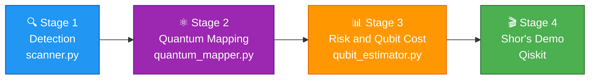

<div align="center">

# 🔐 AI-Powered PQC Migration Advisor

### Quantum-Vulnerability Testing Pipeline

**🔍 Detect → ⚛️ Map → 📊 Estimate → 🛡️ Migrate**

*Find the cryptography that quantum computers will break, and fix it before they do.*

<br>


<br>

🎓 *Final-year B.Tech CSE project · Hindustan College of Science and Technology, Mathura (AKTU)*

[Overview](#-overview) · [Threat](#%EF%B8%8F-the-quantum-threat-at-a-glance) · [Pipeline](#-pipeline) · [Status](#-project-status) · [Quick Start](#-quick-start) · [Team](#-team)

</div>

---

## 🌟 Overview

Today's public-key cryptography (**RSA, ECC, DSA, Diffie-Hellman**) is secure only because classical computers cannot factor large numbers or solve discrete logarithms fast enough. **Shor's algorithm** on a large quantum computer removes that protection. Symmetric primitives (**AES, SHA**) are affected less: **Grover's algorithm** roughly halves their effective strength.

Organisations cannot migrate what they cannot find. This project is a **four-stage pipeline** that:

| | Stage | Question it answers |
|:-:|:---|:---|
| 🔍 | **Detect** | Where does this codebase use quantum-vulnerable cryptography? |
| ⚛️ | **Map** | Which quantum algorithm breaks each primitive (Shor's or Grover's)? |
| 📊 | **Estimate** | How many qubits would an attack need? Is there a classical weakness too? |
| 🛡️ | **Migrate** | Which post-quantum algorithm should replace it? (target: **ML-KEM-768**) |

We validate the pipeline on **two real student projects** that use textbook RSA with no padding, and finish with a working **Shor's algorithm demo** (N = 15 and N = 21) on the Qiskit simulator.

---

## ⚛️ The Quantum Threat at a Glance

| Primitive | Broken by | Impact | Severity |
|:---|:---:|:---|:---:|
| **RSA** | Shor's | Completely broken | 🔴 Critical |
| **ECC** (ECDSA, ECDH, EdDSA) | Shor's | Completely broken | 🔴 Critical |
| **DSA / DH** | Shor's | Completely broken | 🔴 Critical |
| **AES** | Grover's | Effective key strength roughly halved | 🟡 Moderate |
| **SHA-2 / SHA-3** | Grover's | Effective strength roughly halved | 🟡 Moderate |
| **SHA-1 / MD5** | Classical attacks | Already broken today | ⚫ Legacy |

> 💡 **Rule of thumb:** AES-128 drops to about 64-bit effective strength, so use AES-256. Public-key cryptography cannot be patched by a bigger key, it must be **replaced** by post-quantum algorithms.

---

## 🧭 Pipeline



| # | Stage | What it does | Files | Status |
|:-:|:---|:---|:---|:-:|
| 1️⃣ | 🔍 **Detection** | Scans source code for crypto usage, extracts key sizes | `src/scanner.py`, `src/extra_patterns.py`, `src/key_size.py`, `src/run_all.py` | ✅ Done |
| 1️⃣ | 🕵️ **Edge cases** | Missing padding, indirect usage, weak keys | `src/edge_cases.py` | 🔄 In progress |
| 2️⃣ | ⚛️ **Quantum Mapping** | Maps each primitive to Shor's or Grover's | `src/quantum_mapper.py` | 🔄 In progress |
| 3️⃣ | 📊 **Risk and Qubit Cost** | Qubit estimates (Shor: `q ≈ 2n + 3`), risk report, CBOM | `src/qubit_estimator.py` | 🔄 In progress |
| 4️⃣ | 🎬 **Demo** | Shor's algorithm on the Qiskit simulator | `demo/` | ⏳ Planned |

---

## 📈 Project Status

4-week sprint, tracked on the **GitHub Kanban board** and **Issues**.

| Week | Status | Focus |
|:-:|:-:|:---|
| **Week 1** | ✅ Done | Repo setup, general-purpose detection engine, `findings.json` v1. [Summary](docs/week1_summary.md) |
| **Week 2** | 🔄 Next | Real-data validation, unit tests, Shor's demo (N = 15, 21), merge into `main` |
| **Week 3** | ⏳ Planned | Risk scoring, qubit-cost numbers, CBOM, ML-KEM-768 recommendation |
| **Week 4** | ⏳ Planned | Dashboard, final report, demo recordings, timed rehearsal |

## 🔍 Stage 1: Detection Engine

A static scanner that walks a codebase line by line and matches **46 signature patterns** across six primitives.

**What it detects**

| Family | Examples |
|:---|:---|
| 🔑 **RSA** | Library keygen (PyCryptodome, `cryptography`, python-rsa, Java, `openssl genrsa`) and **hand-rolled textbook RSA** (`phi = (p-1)*(q-1)`, `pow(m, e, n)`, `mod_inverse`, `65537`) |
| 🌀 **ECC** | `ec.generate_private_key`, ECDSA, ECDH, X25519, Ed25519, named curves (SECP256R1, P-256) |
| ✍️ **DSA / DH** | `dsa.generate_private_key`, `dh.generate_parameters`, Java `KeyPairGenerator` |
| 🔒 **AES** | `AES.new`, AESGCM, Fernet, Java `Cipher`, ECB mode (flagged as classically weak) |
| #️⃣ **SHA** | `hashlib.sha256`, SHA-3, PyCryptodome, Java `MessageDigest`, plus SHA-1 / MD5 flagged as already broken |

**Smart key-size extraction**

- Resolves values held in variables, constants and function defaults (`getPrime(half)` → `half = key_size // 2` → `key_size = 1024`).
- Separates **per-prime size** from **modulus size** (modulus = 2 × prime size).
- Reads wrapper calls such as `generate_keypair(bits=128)`.
- Stays inside the current call, so it never borrows a number from a neighbouring function.

**Finding format** (one entry per detection in `outputs/findings.json`)

```json
{
  "project": "Final-Year-project-part1",
  "file": "app.py",
  "line": 239,
  "primitive": "RSA",
  "pattern_id": "RSA-WRAPPER-CALL",
  "confidence": "medium",
  "key_size": 128,
  "modulus_bits": 256,
  "size_basis": "keyword argument (per-prime assumed, modulus = 2 x)",
  "snippet": "pub, priv = generate_keypair(bits=128)"
}
```

---

## 🎯 Results on the Target Projects

`findings.json` v1 (scanner v0.4.0):

| Project | Findings | Primitives | Key observation |
|:---|:-:|:---|:---|
| 🎥 **Secure-Video-Steganography** | 9 | RSA 8, SHA 1 | RSA keys of 1024 / 2048 / 3072 bits chosen in the UI; SHA-256 used for frame selection |
| 🖼️ **Final-Year-project-part1** | 15 | RSA 15 | Textbook RSA with a **256-bit modulus** in real use, and `n < 256` in one module |

> ⚠️ **Two kinds of risk are visible already.**
> **Quantum risk:** all RSA here falls to Shor's algorithm.
> **Classical risk:** a 256-bit RSA modulus can be factored on an ordinary computer today, with no quantum computer involved. This is why Week 3 adds a separate key-strength check next to the qubit-cost score.

**Manual notes** (a static scanner cannot determine these)

1. part1 real use: `generate_keypair(bits=128)` gives a 256-bit modulus. The 256 / 512 in `rsa_utils.py` is only a default value.
2. part1 `r_channel_stego.py`: modulus `n < 256`, about 8 bits.
3. steganography: key size is chosen in the UI (default 2048).
4. `bits=N` is assumed to be the per-prime size, based on the `rsa_utils.py` docstring.

---

## 🚀 Quick Start

### 1. Setup

```bash
git clone https://github.com/VaibhavGautam01/PQC-Migration-System.git
cd PQC-Migration-System
git switch tarun/detection-engine

python -m venv venv

# Windows
venv\Scripts\activate
# Linux / macOS
source venv/bin/activate

pip install -r requirements.txt
```

### 2. Scan a codebase

```bash
# Scan one folder or file
python src/scanner.py <path-to-target> --out outputs/scan.json

# Scan both target projects and write the merged outputs/findings.json
python src/run_all.py
```

The target projects must be cloned under `data/targets/` first. That folder is git-ignored, so target code is never pushed.

```bash
git clone https://github.com/tarunsaxena2/Secure-Video-Steganography data/targets/steganography
git clone https://github.com/tarunsaxena2/Final-Year-project-part1 data/targets/final-year-part1
```

### 3. Try the test fixtures

```bash
python src/scanner.py tests/fixtures
```

Expected: **46 findings in 4 files**.

---

## 🗂️ Project Structure

```text
PQC-Migration-System/
├── src/
│   ├── scanner.py            # Stage 1: core scanner and CLI
│   ├── extra_patterns.py     # ECC, DSA, DH, AES, SHA patterns
│   ├── key_size.py           # key-size and modulus extraction
│   └── run_all.py            # merges both scans into findings.json
├── tests/
│   └── fixtures/             # sample code the scanner is verified against
├── outputs/
│   └── findings.json         # Stage 1 output, input for Stages 2 and 3
├── docs/
│   └── week1_summary.md      # weekly summaries
├── demo/                     # Shor's algorithm demo (Week 2 onwards)
├── data/targets/             # cloned target repos (git-ignored)
├── requirements.txt
└── README.md
```

---

## 👥 Team

| | Member | Role | Focus |
|:-:|:---|:---|:---|
| 🧑‍💻 | **Tarun Saxena** | Detection Engine Lead & Repository Owner | `scanner.py`, key-size extraction, `findings.json` |
| 🕵️ | **Vaibhav Gautam** | Edge-Case & Vulnerability Detection Specialist | Padding checks, indirect usage, key-strength check |
| 🧭 | **Uday Pratap Singh** | Migration Advisor & Reporting Engineer | Quantum mapper, CBOM, dashboard |
| 🤖 | **Yatharth Raghuvanshi** | Risk Scoring & ML Engineer | Qubit estimator, risk report, Shor's demo |

---

## 🧾 Commit Convention

Every commit references its GitHub Issue:

```text
type: short description (fixes #N)
```

| Type | Use for |
|:---:|:---|
| ✨ `feat` | New feature |
| 🐛 `fix` | Bug fix |
| 📝 `docs` | Documentation changes |
| ♻️ `refactor` | Code restructuring, no behaviour change |
| 🧪 `test` | Adding or updating tests |
| 🧹 `chore` | Maintenance and tooling |

Each member works on a personal branch and merges into `main` after review.

---

## ⚠️ Known Limitations

- Detection is **static and regex-based**: it can miss dynamically built code and can over-match comments or strings (low-confidence findings are labelled).
- Key sizes chosen at runtime (UI input, config files) are reported as unknown.
- Qubit estimates are **logical** qubits; real attacks would need far more physical qubits for error correction (explained in the Week 3 risk report).

---

<div align="center">

**Built with ❤️ and a healthy fear of quantum computers.**

🎓 HCST Mathura · AKTU · Final-Year B.Tech CSE

</div>
